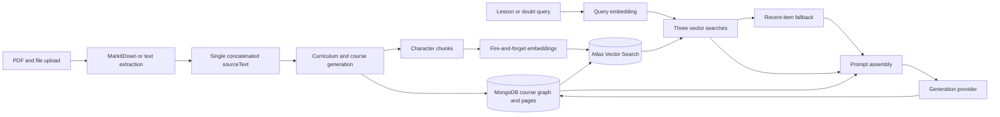
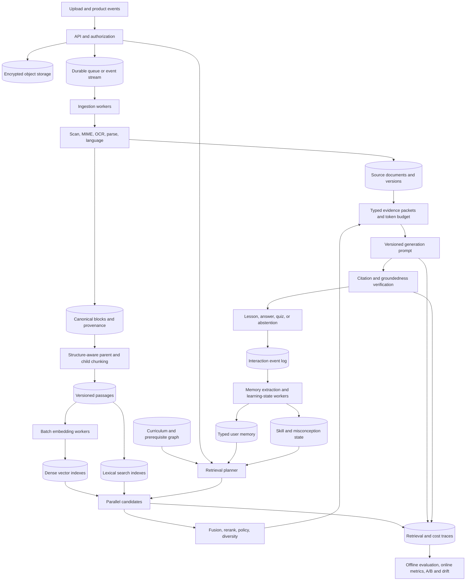

# TruLurn RAG and Memory Architecture Audit

Audit date: 2026-06-13

Scope: static architecture and code-path review of source ingestion, course generation,
lesson generation, doubt answering, embeddings, vector search, learner
personalization, caching, indexing, and operational tooling.

This is not a production load test or an empirical retrieval benchmark. The repository
currently has no RAG evaluation harness from which to make measured quality claims.

## Executive Verdict

The current system is a useful prototype, but it is not a safe production RAG
architecture. Its central problem is not the embedding model or the candidate count.
It is the absence of boundaries between four fundamentally different kinds of data:

1. Uploaded source evidence.
2. AI-generated course content.
3. User and assistant conversation history.
4. Learner state and preferences.

All four can influence generation, but they have different authority, retention,
privacy, ranking, and conflict-resolution rules. Treating them as interchangeable
"course memory" creates silent context pollution and allows generated claims to
reinforce themselves.

The production design should keep these stores separate, route each product workflow
to the stores it actually needs, and assemble typed evidence packets with provenance
and explicit budgets. Retrieval must fail closed: low-confidence or unavailable
retrieval should produce an abstention, a broader controlled retry, or a request for
clarification, never unrelated recent content.

## 1. Current Architecture Review

### Current Flow



### Ingestion and Parsing

- Files are converted to text in the request path. Rich files use a local MarkItDown
  HTTP service; plain-text files are read directly.
- Extracted files are concatenated into a single string separated by textual source
  headers.
- There is no durable source registry, object storage record, document version,
  checksum, ingestion state machine, parser version, OCR confidence, malware scan,
  MIME validation, or idempotency key.
- A parser outage or serverless timeout is exposed directly to course generation.
- Scanned or image-heavy PDFs can produce no usable text without a dedicated OCR
  path. Parser success is treated as document readiness rather than one stage of a
  durable ingestion workflow.

### Preprocessing and Chunking

`lib/course-generation/mongoPersistence.ts:12-38` uses 1,500-character chunks with
150-character overlap and only a paragraph-boundary heuristic.

The persisted chunk at
`lib/course-generation/mongoPersistence.ts:53-90` contains only course, user, source
title, content, and creation time. It lacks:

- Source document and source version identifiers.
- Chunk order, page number, section path, and character/token offsets.
- Content hash, parser version, language, and extraction confidence.
- Access-control policy, sensitivity, authority, and validity timestamps.
- Topic mapping, parent section, table/code/media type, and citation coordinates.

This prevents reliable citations, parent expansion, reprocessing, deduplication,
version invalidation, conflict handling, and selective deletion.

### Embeddings and Indexing

- Pages, source chunks, user messages, and assistant messages are embedded.
- Source and doubt-message embedding is launched without awaiting durable completion
  (`mongoPersistence.ts:96-103`, `handleDoubt.ts:380-394`).
- Runtime embedding selection uses the feature router, while
  `scripts/setup-vector-search.mjs:22-31` uses the older global `AI_PROVIDER` rule.
  Backfill and runtime can therefore select different providers or models.
- Records store `embedding_model`, but retrieval does not constrain candidates to a
  compatible embedding version, provider, dimension, or preprocessing revision.
- `lib/vector/indexes.ts:68-75` treats an index with the expected name as valid and
  never compares its definition with the active model dimensions.
- Pages are embedded as one large representation. Long, multi-concept pages suffer
  vector dilution, and provider input is truncated to 16,000 characters.
- Backfills are sequential and capped at 200 or 500 records per run. They have no
  queue, checkpoint, retry policy, dead-letter handling, or rate-control state.

### Retrieval

`retrieveCourseMemory` runs dense retrieval over pages, doubt messages, and source
chunks using one query vector.

Key behavior:

- Tenant/course filtering is applied in vector search, which is correct when `userId`
  is present.
- Current-topic exclusion and topic matching are applied after ANN candidate
  generation (`retrieval.ts:212-246`, `retrieval.ts:429-451`). Valid candidates can
  be removed after the candidate budget has already been spent.
- There is no lexical retrieval, score threshold, reranker, diversity control,
  authority weighting, freshness policy, or duplicate suppression.
- An empty vector result or any vector-search exception silently returns recent pages,
  messages, or source chunks (`retrieval.ts:250-266`, `455-468`).
- Source chunks are generally untagged with topics, so topic-aware source retrieval
  does not provide the intended discrimination.
- User and assistant messages share a corpus and ranking path. An earlier assistant
  hallucination can be retrieved as support for a later answer.

### Context Assembly and Prompting

- Lesson generation retrieves up to 3 pages, 3 doubt messages, and 8 source chunks for
  source-grounded courses on every page-generation request.
- Doubt prompts call prior doubts, prior course pages, and source material a shared
  "source of truth" (`lib/doubts/context.ts:356-369`).
- The system does not preserve source coordinates or expose a claim-to-evidence map.
- There is no single context budget across current page, chat history, source
  evidence, prior pages, learner state, and workspace context.
- Raw retrieved content is not treated as untrusted data. Uploaded prompt-injection
  instructions can enter the system prompt alongside application instructions.
- Validation warnings for generated lesson architecture are logged but do not trigger
  a repair pass or block persistence.

### Generation Layer

- Provider routing is substantially better than a hard-coded provider, but generation
  records do not consistently persist the full route, prompt version, retrieval trace,
  evidence IDs, and fallback sequence.
- Source-grounded generation can begin before all source embeddings are ready.
- There is no groundedness verifier for source-constrained output and no citation
  requirement that can be checked programmatically.
- Web research and source-grounded material correctly take different paths, but
  generated course pages can later be retrieved without a clear authority distinction.

### Learner Personalization and Memory

The learner profile is a cached, course-local aggregation of feedback, recent exams,
recall ratings, doubts, and pace. It is useful as an early personalization signal, but
it is not a production memory system.

Problems:

- Three-value labels collapse uncertainty and hide evidence quality.
- Doubt frequency can mean confusion, curiosity, or high engagement.
- Self-reported recall and assessed mastery are not modeled separately.
- There is no global user preference layer across courses.
- Contradictory preferences and observations have no precedence or history.
- Memory has no explicit confidence, provenance, validity interval, decay policy,
  sensitivity class, or user-editable state.
- Free-text style directives can accumulate contradictions and exact-string
  duplicates.
- Raw conversation is retained and embedded as if it were durable semantic memory.

### Caching and Evaluation

- The concept-map cache is process-local with a two-minute TTL.
- Learner profiles use a ten-minute database TTL check but have no event-driven
  invalidation.
- There is no distributed retrieval cache, embedding cache keyed by content hash,
  parser cache, or cross-instance invalidation.
- No RAG-specific tests or evaluation suite were found.
- There are no judgment sets, hard negatives, Recall@K, nDCG, MRR, context precision,
  citation precision, groundedness, or retrieval-stage latency metrics.

## 2. Identified Issues and Root Causes

### Critical

| ID | Issue | Root cause | Impact |
|---|---|---|---|
| C1 | Empty/error retrieval returns unrelated recent content | Availability fallback is mixed with relevance logic | Silent false grounding and context pollution |
| C2 | Incompatible embedding spaces can coexist | No immutable embedding version or blue/green index contract | Wrong similarity results or query failures after provider/model changes |
| C3 | Embedding jobs are fire-and-forget in request handlers | No durable background job architecture | Missing vectors, lost work, inconsistent readiness |
| C4 | Generated chat answers are eligible evidence | Evidence, conversation, and memory share retrieval semantics | Self-reinforcing hallucinations |
| C5 | Uploaded/retrieved content crosses the prompt trust boundary | No untrusted-context protocol or instruction filtering | Indirect prompt injection and data exfiltration risk |

### High

| ID | Issue | Root cause | Impact |
|---|---|---|---|
| H1 | Crude character chunking loses document structure | Chunking is coupled to persistence and raw text | Lower recall, poor citations, split tables and concepts |
| H2 | Dense-only first-stage retrieval | No lexical index, routing, or fusion | Misses exact terms, formulas, names, and rare concepts |
| H3 | No reranking, thresholds, or diversity | Vector score is accepted directly | Low precision and repeated near-duplicate context |
| H4 | Filters occur after ANN candidate selection | Retrieval predicates are not fully modeled as index filters | Candidate starvation and false empty results |
| H5 | Whole-page single vectors | Artifact and retrieval units are the same | Multi-concept dilution and truncation |
| H6 | No durable ingestion/indexing workflow | Request handlers own long-running work | Poor reliability, latency, and operational recovery |
| H7 | No RAG evaluation or retrieval telemetry | Product checks focus on generated structure | Quality regressions cannot be detected or attributed |
| H8 | Learner memory lacks conflict and decay semantics | Profile aggregation substitutes for a memory model | Personalization drift and stale/contradictory behavior |
| H9 | No end-to-end context budget | Each context producer truncates independently | Token overflow, lost high-value evidence, higher cost |
| H10 | Source-grounded output is not auditable | No source coordinates or claim citations | Cannot prove fidelity or diagnose hallucinations |

### Medium

- Process-local caches create inconsistent behavior across replicas.
- Missing compound indexes increase fallback and profile-query costs.
- Source text is duplicated in the course record and source chunks.
- No document-level deduplication or re-embedding idempotency exists.
- Source authority, freshness, and conflicts are not represented.
- The source profile samples the head and tail for long documents, which can omit the
  body when deciding structure and teaching approach.
- User-triggered vector setup/backfill combines administrative and request concerns.
- Provider calls lack a complete per-query cost and fallback ledger.
- Deletion, retention, export, and provider-processing policies are incomplete.
- Documentation and implementation have materially diverged, increasing migration and
  incident risk.

### Low

- Naming still conflates "memory" with retrieval context.
- Source title parsing depends on a text-header convention.
- Exact-string style-directive deduplication is brittle.
- Some lookups rely on globally unique IDs without expressing the course predicate.

## 3. Assumptions That Should Be Rejected

1. **More source chunks means better grounding.** It often means more distractors.
   Retrieval quality and evidence authority matter more than raw context volume.
2. **Recent content is an acceptable vector-search fallback.** Recency is not
   relevance. This fallback should be removed.
3. **Conversation history is long-term memory.** Raw chat is an event log. Only
   validated, typed, useful facts should be promoted to durable memory.
4. **One embedding per page is enough.** The displayed artifact and retrieval unit
   should be different.
5. **One retrieval policy fits every feature.** Lesson generation, doubt answering,
   quizzes, recall, and curriculum planning need different corpora and ranking.
6. **Vector similarity is a confidence score.** It is one ranking feature and is not
   calibrated truth probability.
7. **A named index is a valid index.** Index definitions and embedding versions must
   be reconciled, not merely discovered by name.
8. **Agentic retrieval should be the default.** It adds latency, variance, and cost.
   Use it only for classified multi-hop or ambiguous requests.
9. **A generic knowledge graph will automatically improve RAG.** TruLurn already has
   a useful curriculum/prerequisite graph. Expand that graph for deterministic
   prerequisite retrieval; do not build an unbounded extracted fact graph without
   measured need.

## 4. Proposed Architecture Redesign

### Domain Boundaries

| Store | Contents | Authority | Typical consumers |
|---|---|---|---|
| Source Evidence | Parsed uploaded documents and passages | Highest for source-grounded claims | Curriculum, lessons, doubts, quizzes |
| Course Canon | Published lesson summaries, objectives, examples | Product-authored, below original sources | Continuity, deduplication, review |
| Learning Graph | Topics, prerequisites, objectives, skill IDs | Structural authority | Routing, sequencing, graph expansion |
| Learner Model | Mastery, misconceptions, goals, preferences | User/assessment-derived | Personalization and difficulty |
| Interaction Log | Turns, clicks, feedback, attempts | Raw event evidence, not prompt truth | Analytics and memory extraction |
| Working Session | Recent turn summary and active task | Short-lived | Current interaction only |

### Ingestion Plane

1. Accept upload and create an immutable `source_document` plus `document_version`.
2. Store the original object in encrypted object storage and record checksum, MIME
   type, byte size, tenant, course, and retention policy.
3. Publish an idempotent ingestion job.
4. Run malware scan, MIME validation, parser/OCR selection, language detection, and
   extraction in isolated workers.
5. Produce canonical blocks: headings, paragraphs, lists, tables, code, captions, and
   page coordinates.
6. Compute quality signals and reject or flag unreadable versions.
7. Chunk by structure into:
   - Parent sections of roughly 800-1,500 tokens.
   - Child passages of roughly 200-450 tokens with 10-15% overlap where needed.
   - Specialized table, code, and formula chunks.
8. Persist provenance and hashes before scheduling batch embeddings.
9. Mark a document version `retrieval_ready` only when required indexes are complete.

Chunk sizes are starting points, not constants. Tune them against TruLurn judgment
sets by content type.

### Embedding and Index Plane

Use an immutable version key such as:

`provider:model:dimensions:normalization:chunker_version:content_schema_version`

Every vector-bearing record must store this key, content hash, status, attempt count,
and generation time. Retrieval must target exactly one active version.

For model changes:

1. Create a new physical vector field/index or versioned collection.
2. Backfill asynchronously in batches with checkpoints and rate limiting.
3. Shadow-query old and new versions.
4. Compare relevance, latency, and cost.
5. Switch the active alias/config.
6. Retain rollback capability before deleting the old version.

Use content-hash embedding reuse within the same tenant and policy boundary. Global
deduplication is appropriate only for explicitly public corpora because cross-tenant
deduplication can create privacy and side-channel concerns.

### Retrieval Plane

Build one retrieval service with feature-specific policies:

1. **Query classification:** workflow, intent, language, entity/exact-term density,
   temporal need, and complexity.
2. **Scope planning:** choose allowed corpora, tenant/course/topic/version filters,
   and retrieval budget.
3. **Candidate generation:** dense and sparse search in parallel, generally 30-50
   candidates each.
4. **Fusion:** reciprocal-rank fusion with query-aware weighting.
5. **Reranking:** cross-encoder or compact reranker over the top 20-40 candidates.
6. **Policy scoring:** authority, freshness, learner scope, source diversity, and
   contradiction penalties.
7. **Selection:** threshold, per-source cap, near-duplicate removal, and MMR-style
   diversity.
8. **Parent expansion:** return a high-scoring child plus the smallest coherent parent
   section and adjacent context.
9. **Failure policy:** controlled query rewrite, broader scope, clarification, or
   abstention. Never substitute unrelated recent records.
10. **Trace:** persist query version, candidates, scores, selected evidence, latency,
    and model versions.

For MongoDB Atlas, benchmark native hybrid fusion against application-side parallel
search. Native rank-fusion sub-pipelines currently execute serially, so application
fusion can be preferable when latency matters.

### Workflow Policies

| Workflow | Allowed evidence | Personalization | Explicitly excluded |
|---|---|---|---|
| Curriculum planning | Source evidence, source outline, learning graph templates | Goals and declared level | Raw chats and assistant answers |
| Lesson generation | Topic source passages, prerequisite canon, learning graph | Mastery, pace, preferences | Unverified assistant messages |
| Doubt answering | Current page, cited source evidence, relevant canon | Misconceptions and working session | Assistant history as factual evidence |
| Quiz generation | Objectives, source evidence, canon | Mastery and recent error types | Conversational prose |
| Recall/review | Canon summaries, skill state, prior assessed errors | Retention model | Broad source search unless needed |

### Context Assembly

Create a typed `EvidencePacket`:

```text
id, corpus, authority, source_document_id, source_version,
page/section coordinates, timestamp, valid_at, score breakdown,
content, token_count, sensitivity, and retrieval reason
```

Allocate a total prompt budget before formatting:

- Current task and current page.
- Primary source evidence.
- Course canon/prerequisites.
- Learner instructions.
- Working-session summary.

Deduplicate semantically and by source coordinates. Prefer extractive compression;
use model-based compression only when the query is complex enough to justify its
latency and risk. Retrieved content must be clearly delimited as untrusted data and
must never be allowed to override system instructions.

### Generation and Verification

- Use prompt templates with immutable versions and typed inputs.
- Require structured citations for every source-grounded factual section.
- Persist generation provider/model, prompt version, retrieval trace ID, evidence IDs,
  token usage, latency, and fallback route.
- For source-grounded lessons and high-impact answers, run a lightweight claim-evidence
  verifier. Repair unsupported claims or mark them as explanation/inference.
- Do not use generated content as evidence until it is published and linked to its
  supporting sources. Even then, rank original sources above course canon.

## 5. Production-Ready Memory Augmentation Framework

### Memory Types

1. **Working memory:** current task, current page, and a short session summary. TTL in
   hours.
2. **Episodic learning events:** completed lesson, failed attempt, correction,
   interruption, and explicit feedback. Retained for analytics and model updates, not
   inserted raw into prompts.
3. **Semantic user facts:** explicit goals, accessibility needs, declared background,
   and stable preferences.
4. **Procedural preferences:** explanation density, example-first preference, desired
   pacing, notation style, and interaction mode.
5. **Skill state:** probabilistic mastery and retention per stable skill ID.
6. **Misconception state:** misconception, evidence, remediation attempts, confidence,
   and resolution status.

### Memory Record Contract

```text
memory_id
tenant_id / user_id
type and subtype
scope: global | course | topic | skill | session
value: typed payload
confidence
importance
source: explicit_user | assessment | behavior_inference | system
evidence_event_ids
observed_at
valid_from / valid_to
last_confirmed_at
decay_policy
status: candidate | active | contradicted | expired | deleted
sensitivity
schema_version
```

### Promotion Rules

- Explicit user preferences can be promoted immediately with a user-visible control.
- Behavioral observations require repeated independent evidence.
- Assistant-generated statements never become user memory without evidence or user
  confirmation.
- Assessment-derived mastery updates skill state, not free-text semantic memory.
- A memory extraction worker proposes typed candidates from events. Deterministic
  validation and policy rules decide promotion.

### Conflict Resolution

Use authority first, then evidence quality, then recency:

`explicit current user statement > validated assessment > repeated behavior > single inference`

Do not overwrite history. Close the old validity interval, preserve both records, and
mark the superseded or contradicted state. If high-authority records conflict, ask the
user or avoid applying the preference.

### Decay and Pruning

- Working memory: hours.
- Raw episodic events: policy-based hot/warm/cold retention.
- Inferred preferences: confidence decay without reinforcing evidence.
- Explicit preferences and accessibility needs: no passive deletion, but periodic
  confirmation and user controls.
- Misconceptions: decay only after successful evidence of correction.
- Skill mastery: use a calibrated learning/forgetting model rather than document TTL.
- Prune low-confidence, low-utility inferred items; retain compact aggregates and
  auditable event references.

### User-Aware Ranking

Memory retrieval should be a constrained ranker, not a general vector search:

```text
score =
  semantic_relevance
  + scope_match
  + confidence
  + importance
  + evidence_quality
  + temporal_applicability
  - contradiction_penalty
  - staleness_penalty
```

Hard filters for user, active status, scope, sensitivity policy, and valid time are
applied before ranking. Memory changes presentation and sequencing; it must not alter
the factual evidence base.

## 6. Retrieval Optimization Plan

### Techniques With Measurable Product Value

| Technique | Recommendation | Why |
|---|---|---|
| Dense + sparse hybrid | Adopt | Educational queries contain both concepts and exact terminology |
| Multi-stage retrieval | Adopt | High recall first stage plus high precision reranking |
| Parent-child chunks | Adopt | Supports precise matches with coherent teaching context |
| Curriculum graph expansion | Adopt selectively | Prerequisites and adjacent skills are known, useful relations |
| User-aware retrieval | Adopt for ranking/instructions | Mastery and misconceptions should affect teaching context |
| Session-aware retrieval | Adopt with a strict TTL | Prevents repetition and preserves active task continuity |
| Query decomposition | Use for multi-part or comparative questions | Avoids missing one part of a complex question |
| Adaptive routing | Adopt | Different features require different corpora and budgets |
| Context compression | Adopt after reranking | Reduces token cost and distractors |
| Agentic retrieval | Gate to complex cases | Useful for multi-hop research, too costly and variable by default |
| Generic knowledge graph extraction | Defer | Existing curriculum graph covers the highest-value relations |
| Multi-vector retrieval | Pilot | Add title/concept-summary vectors only if evaluation shows lift |

### Initial Quality Targets

Establish a labeled test set by workflow and content type, then target:

- Source retrieval Recall@20 >= 0.95 on answer-bearing passages.
- Reranked nDCG@10 improvement >= 15% over current dense retrieval.
- Context precision >= 0.80 for selected prompt evidence.
- Citation support precision >= 0.95 for source-grounded output.
- Unsupported factual claim rate < 2% on the audited source-grounded set.
- Retrieval p95 <= 250 ms without decomposition and <= 700 ms with reranking.
- Empty/low-confidence retrieval handled without unrelated fallback in 100% of cases.

Targets must be revised after baseline measurement. They are service objectives, not
claims about current performance.

## 7. Failure Mode Analysis

| Failure mode | Current behavior/risk | Required mitigation |
|---|---|---|
| Large document collection | Candidate dilution, long ingestion, high index cost | Hierarchical chunks, document routing, batch jobs, source caps |
| Conflicting sources | Similar chunks are mixed without authority or time | Version/authority metadata, conflict detection, cite both, ask policy |
| Ambiguous query | One vector search guesses intent | Clarification or bounded query decomposition |
| Long conversation | Raw history and old answers pollute context | Working summary, typed promotion, strict history budget |
| Memory drift | Inferences accumulate without validity | Confidence, bitemporal records, decay, user correction |
| Retrieval collapse | Empty ANN result becomes recent content | Fail closed, retry policy, observability, abstention |
| Context overflow | Independent context producers compete | One token allocator, reranking, compression, priority tiers |
| Stale memory | Cached profile and old preference stay active | Event invalidation, valid intervals, confirmation policy |
| Preference contradiction | Free-text directives conflict | Typed preferences, precedence, contradiction state |
| Sparse user data | Profile overfits a few events | Neutral defaults, uncertainty, exploration, no forced inference |
| Rapidly changing knowledge | Old passages remain equally valid | Document versions, `valid_at`, freshness and authority ranking |
| Scanned PDF | No extracted text | OCR path, extraction confidence, user preview |
| Table/formula split | Character chunks destroy semantics | Block-aware table/formula chunks and parent context |
| Prompt injection in document | Instructions enter trusted prompt | Untrusted delimiters, instruction detection, tool/data isolation |
| Provider outage/rate limit | Fire-and-forget loss or request failure | Queue retries, circuit breaker, idempotency, provider policy |
| Embedding model migration | Mixed spaces and index mismatch | Versioned dual indexes, shadow tests, atomic cutover |
| Hot tenant/noisy neighbor | Shared ANN resources degrade | Tenant prefilter, routing, quotas, partitions/shards |
| User deletion request | Derived vectors/memory may remain | Lineage-aware cascade deletion and tombstones |

## 8. Scalability Roadmap

### Stage A: Thousands to 50,000 Users

- Keep MongoDB Atlas as system of record and vector/search platform.
- Add object storage, durable jobs, workers, structured passages, hybrid retrieval,
  reranking, retrieval traces, and an offline evaluation harness.
- Use one collection per corpus with `tenant_id`, `course_id`, and version prefilters.
- Benchmark flat versus HNSW indexes because most course-scoped tenant partitions may
  contain fewer than 10,000 vectors.
- Add Redis for distributed job coordination, short-lived result caching, rate limits,
  and cache invalidation.

### Stage B: 50,000 to 500,000 Users

- Separate ingestion, embedding, retrieval, memory, and generation worker pools.
- Add event streaming for learning events and memory updates.
- Partition operational collections by tenant/user hash and time where appropriate.
- Introduce hot/warm/cold retention for interaction events.
- Use blue/green index releases and automated re-embedding workflows.
- Add per-tenant quotas, backpressure, SLO dashboards, and cost attribution.

### Stage C: 500,000 to Millions of Users

- Deploy a stateless retrieval service behind regional load balancing.
- Route by tenant size. Small tenants can use filtered flat indexes; very large tenants
  can use HNSW-backed views/partitions or dedicated capacity.
- Shard by a stable tenant routing key when the number of large tenants requires it.
- Keep a vector-store abstraction, but do not move to a dedicated vector database
  solely for fashion. Move when measured Atlas cost, index build time, tail latency,
  filtering, or operational isolation fails SLOs.
- Regionalize object storage, queues, model routing, and deletion workflows according
  to data residency requirements.
- Precompute compact course-canon and skill-memory representations instead of embedding
  every raw event.

## 9. Cost and Performance Tradeoffs

| Choice | Benefit | Cost/risk | Recommendation |
|---|---|---|---|
| 768-dimensional vectors | Lower storage, memory, and distance cost | Possible quality loss | Keep only after benchmark; version it |
| Hybrid retrieval | Better rare-term and semantic recall | Two searches and fusion | Default for source/course evidence |
| Cross-encoder reranking | Major precision improvement | Added 30-150 ms and model cost | Rerank top 20-40, cache stable queries |
| Parent expansion | Coherent context and citations | More prompt tokens | Expand only selected children |
| Model context compression | Lower final prompt size | Extra latency and possible information loss | Prefer extractive; model compression on complex cases |
| Agentic decomposition | Better multi-hop coverage | High cost, latency, variance | Gate by classifier and step/token budget |
| Dedicated vector DB | Specialized scaling/operations | New system and consistency burden | Defer until Atlas misses measured SLOs |
| Global content dedupe | Lower embedding/storage cost | Privacy and side-channel risk | Public corpora only; tenant-scoped otherwise |
| Groundedness verification | Lower hallucination rate | Extra generation pass | Required for source-grounded publish paths |

The cheapest query is not necessarily the smallest model call. Better retrieval and
reranking often reduce expensive generation tokens and retries. Track cost per
successful grounded answer, not cost per individual API call.

## 10. Migration Strategy

### Phase 0: Stop Correctness Failures

1. Remove recent-item fallbacks from vector retrieval.
2. Exclude assistant messages from factual evidence retrieval.
3. Move topic/current-topic filters into vector prefilters where supported.
4. Add embedding version and readiness fields; reject incompatible records.
5. Block source-grounded generation until source indexing is ready.
6. Delimit all retrieved content as untrusted and persist retrieval traces.

### Phase 1: Build the New Ingestion Model

1. Add source document/version, canonical block, passage, and job collections.
2. Store originals in object storage.
3. Implement durable parse/chunk/embed jobs with idempotency and retries.
4. Dual-write new uploads to the old and new schemas temporarily.

### Phase 2: Build Retrieval V2

1. Add lexical indexes and structured filters.
2. Implement dense+sparse candidates, fusion, reranking, thresholds, and diversity.
3. Add workflow-specific retrieval policies and context budgets.
4. Run V2 in shadow mode and compare traces against V1.

### Phase 3: Source Fidelity and Citations

1. Return source coordinates in evidence packets.
2. Require citations in source-grounded lessons and answers.
3. Add claim-evidence verification and repair.
4. Make source conflicts visible rather than blending them.

### Phase 4: Memory V2

1. Preserve raw events but stop retrieving raw assistant answers as memory.
2. Add typed memory candidates, promotion rules, conflict handling, and decay.
3. Build probabilistic skill and misconception state.
4. Add user controls to view, correct, and delete durable memory.

### Phase 5: Cutover and Cleanup

1. Re-embed historical sources into a versioned V2 index.
2. Canary by user/course cohort with rollback.
3. Cut feature policies over independently.
4. Retire old vector fields, scripts, and documentation only after parity and deletion
   validation.

## Final Recommended Architecture



## Immediate Decision

Do not optimize the current `retrieveCourseMemory` abstraction in place. Replace it
with workflow-specific retrieval policies over separate evidence, canon, and memory
stores. The first production milestone should be correctness and observability:
fail-closed retrieval, versioned embeddings, durable indexing, assistant-answer
exclusion, provenance, and an evaluation set. Hybrid retrieval and reranking should
follow immediately after those foundations because their value cannot be measured
reliably before the evidence model is trustworthy.

## External References

- MongoDB Vector Search query behavior, prefilters, and candidate tuning:
  https://www.mongodb.com/docs/vector-search/query/aggregation-stages/vector-search-stage/
- MongoDB hybrid search and reciprocal rank fusion:
  https://www.mongodb.com/docs/vector-search/hybrid-search/hybrid-search-overview/
- MongoDB ANN versus ENN accuracy measurement:
  https://www.mongodb.com/docs/vector-search/query/improve-accuracy/
- MongoDB multi-tenant vector architecture:
  https://www.mongodb.com/docs/vector-search/deployment/multi-tenant-architecture/
- OpenAI embedding dimension tradeoffs:
  https://developers.openai.com/api/docs/guides/embeddings
- Gemini embedding dimensionality:
  https://ai.google.dev/gemini-api/docs/embeddings
